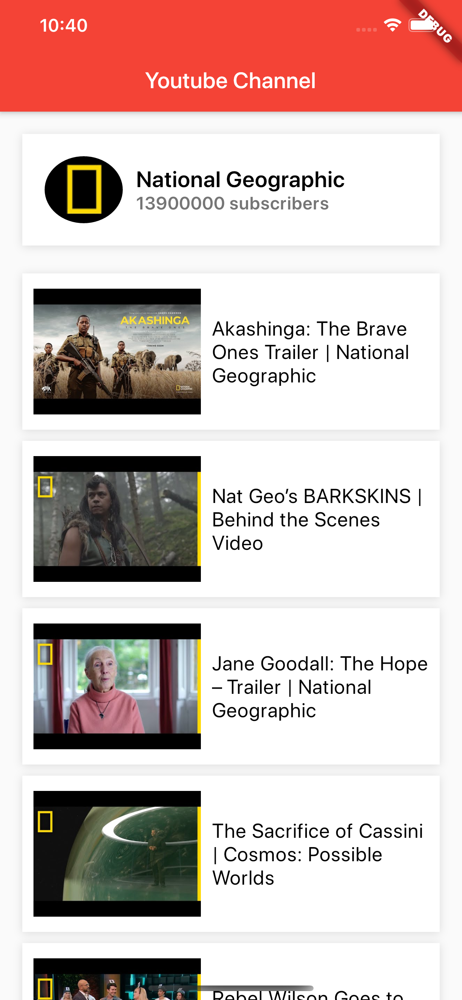
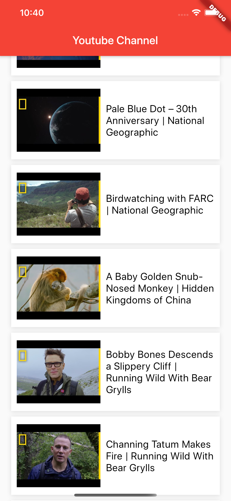
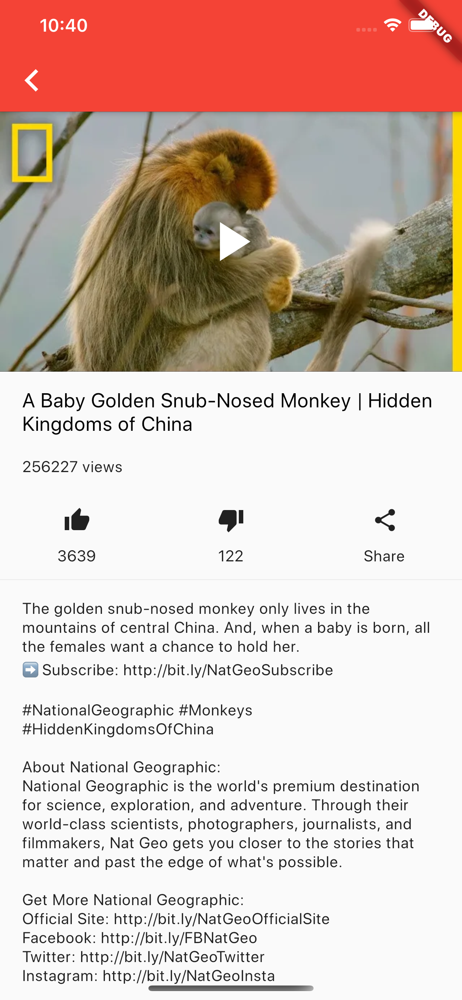
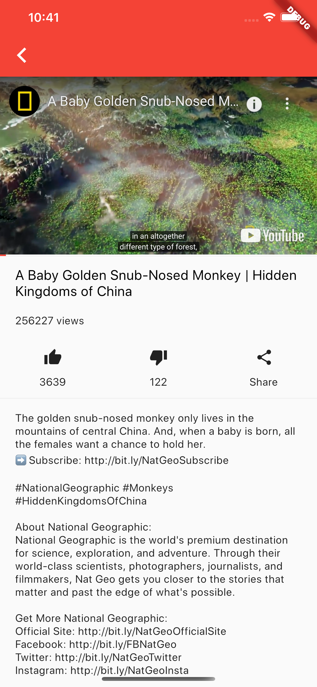
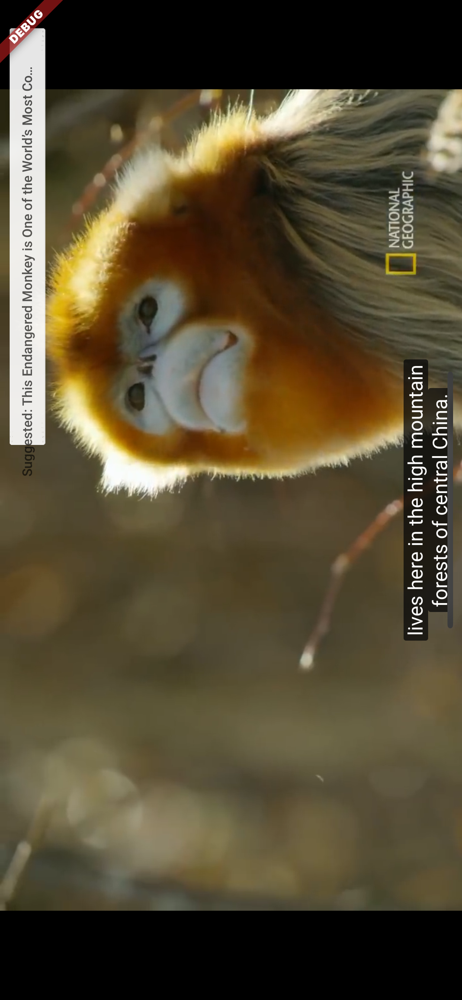

# Flutter Youtube API Sample App

This is a simple app which uses Youtube V3 API to fetch videos from upload playlists and fetch video info. 
A Youtube Player is included alongside video like, dislike, views count and description.

## Getting Started

To use Youtube API, you need to provide your own API_KEY.
Create a file named keys.dart in lib/utilities/ and add this line of code :

const String API_KEY = 'YOUR_API_KEY';

## Screenshots

